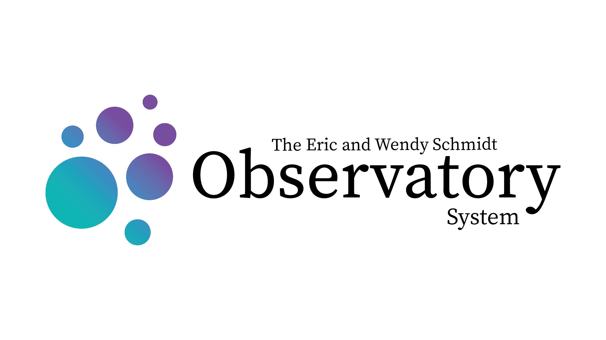

[](https://github.com/schmidt-observatories/wcc-etc/actions/workflows/tests.yml)

# wcc-etc
Exposure Time Calculator (ETC) for the Widefield Context Camera on Lazuli.

A web-based ETC is available here: https://simulators.schmidtobservatorysystem.org/wcc/

# Installation

## **1. Clone the Repository**
```sh
git clone git@github.com:schmidt-observatories/wcc-etc.git
cd wcc-etc
```

## **2. Install the Package**
Install the package itself:
```sh
pip install -e .
```

If you need to install additional dependencies, can run
```sh
pip install -r requirements.txt
```

# Quick Start

```python
from wcc_etc import get_scene, Simulation

# Create a simple scene (stellar source only)
scene = get_scene("K3IV", mag=20, host=None, background="zodi")

# Create a simulation for a sensor (kind:band format) and the scene
sim = Simulation.from_sensor_and_scene("sony:bb", scene)

# Compute SNR for a single exposure time (seconds). get_snr uses the 2D image
# simulation and returns a dict; ["snr"] is the signal-to-noise ratio.
snr = sim.get_snr(10)["snr"]

# Update scene or instrument parameters (example: change source magnitude)
sim.update(source__mag=22)

# Recompute SNR after the change
snr_new = sim.get_snr(10)["snr"]
```

# Tutorial
See the `notebooks/` directory for example tutorials:

| Notebook | What it covers |
|---|---|
| `01_getting_started.ipynb` | Getting started: the scene → simulation → SNR workflow, updating parameters, plotting. |
| `02_saturation_flag.ipynb` | Peak-pixel / saturation flagging (`get_peak_pixel`, `is_saturated`). |
| `03_from_sensorfilter.ipynb` | `from_sensorfilter` — auto PSF selection by sensor:filter focus level (in-focus vs defocused). |
| `04_psf_and_image_snr.ipynb` | PSF simulator (`AiryPSF`/`DefocusPSF`), `ImageSimulator`, and PSF-aware SNR (`get_image_snr`) with aperture optimization. |
| `05_n_reads_exptime.ipynb` | `n_reads` and the exposure-time-for-SNR inverses (`get_exptime_for_snr`, `get_image_exptime_for_snr`); per-frame saturation. |
| `06_source_spectra.ipynb` | Parametric source spectra in `get_scene` (blackbody/flat/powerlaw/emission) and rebuilding via `update`. |


# Notes
Configuration files (.toml) are in the src/wcc_etc/data/config/ directory. Notebooks show that it is easy to change default configuration parameters on the fly.

## Documentation

The full documentation site (installation, a user guide, rendered tutorial
notebooks, and an auto-generated API reference) is built with **Sphinx** and
the *Read the Docs* theme. It lives under `docs/sphinx/`:

```bash
pip install -e .                              # so autodoc can import wcc_etc
pip install -r docs/sphinx/requirements.txt   # Sphinx + theme + nbsphinx
# plus a pandoc binary (conda install pandoc / brew install pandoc)
cd docs/sphinx
make html                                     # output in _build/html/index.html
```

A `.readthedocs.yaml` is included so the site builds automatically once the
repository is connected to Read the Docs.

