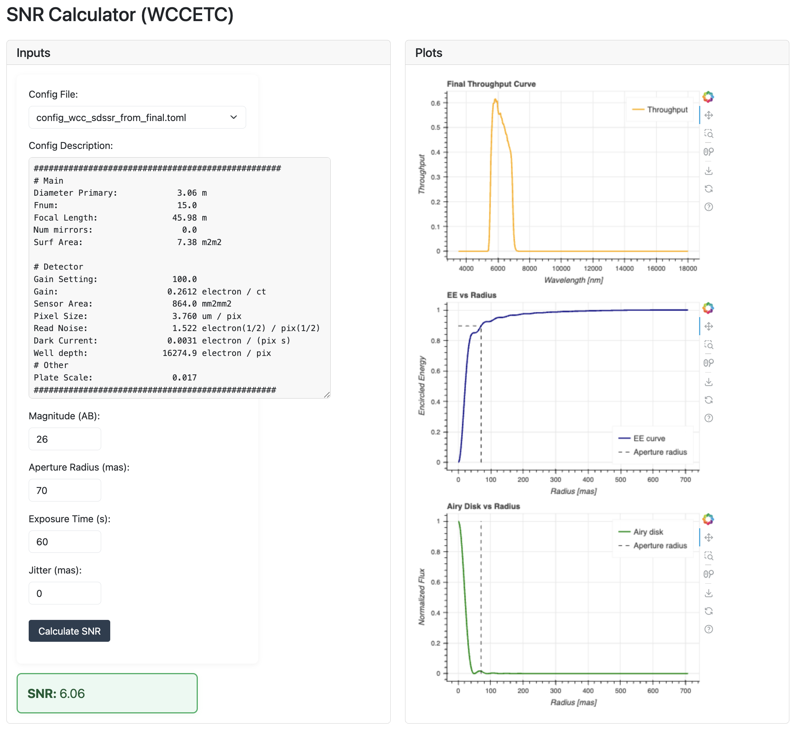

# WCC-ETC Documentation

Welcome to the documentation for the WCC-ETC package!


*Screenshot of the WCC ETC web applet interface.*

## Installation

```bash
pip install wcc-etc
```

## Usage

```python
import wcc_etc
# ...example usage...
```

## Features
- Fast exposure time calculator
- Airy disk and PSF modeling
- SNR calculations
- Background and source spectrum support

## Links
- [GitHub Repository](https://github.com/uasal/config_stp)
